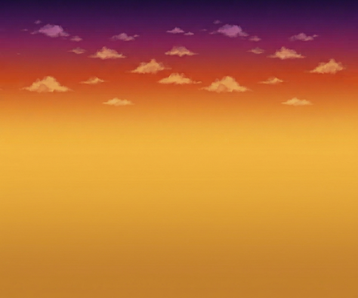

# TG Motocross 2 — HTML5 Port

A faithful HTML5/Canvas port of the classic Flash game **TG Motocross 2** (originally by Teagames Limited, 2006), rebuilt from scratch using vanilla JavaScript with a custom physics engine, sprite-based rendering, and full gameplay systems.



---

## 🎮 Play Now

**[▶ Play Live](https://zeeshan-asghar-forge.github.io/tgmotocross2/)**

---

## 🕹️ Controls

| Key | Action |
|---|---|
| `Arrow Up` | Accelerate / Throttle |
| `Arrow Down` | Brake |
| `Arrow Left` | Lean backward |
| `Arrow Right` | Lean forward |
| `P` | Pause / Resume |
| `Space` | Start game from menu |
| `M` | Toggle sound |

---

## ✅ Features

- **Custom physics engine** — Verlet integration with rigid body constraints
- **Terrain collision** — Precise segment-based collision detection from original map data
- **Articulated rider** — Full body with helmet, torso, arms, forearms, thighs and shins
- **3-lap race system** — Complete 3 laps to win, crash at any point and it's game over
- **Race timer** — Centisecond-precision timer displayed as `MM:SS.cc`
- **Minimap** — Live terrain map with player position indicator
- **Dirt particles** — Dynamic particle system spawned at wheel contact points
- **Parallax background** — Scrolling background creating depth effect
- **Full UI** — Menu, pause screen, game over screen, win screen
- **Scrolling message ticker** — Bottom bar with game instructions
- **Sound toggle** — Mute/unmute button always visible

---

## 📂 Project Structure

```
tgmotocross2/
├── index.html          # Main entry point — game loop, rendering, UI
├── game.js             # Core game logic
├── maps.js             # Level data — tile maps, track sizes, collision segments
├── extract_maps.py     # Python utility to extract map data from original SWF
├── assets/
│   ├── tiles.png       # Terrain tile sheet
│   ├── sprites/
│   │   ├── bikeBody/   # Motorcycle frame
│   │   ├── wheel/      # Wheel sprite
│   │   ├── bikeBackShaft/
│   │   ├── bikeFrontShockBase/
│   │   ├── bikeFrontShockShaft/
│   │   ├── bikeFrontShockTip/
│   │   ├── manHead/    # Rider helmet
│   │   ├── manTorso/   # Rider torso
│   │   ├── manArm/     # Upper arm
│   │   ├── manForearm/ # Forearm
│   │   ├── manThigh/   # Upper leg
│   │   ├── manShin/    # Lower leg
│   │   ├── bg/         # Parallax background
│   │   └── dirt/       # Dirt particle images (1–8)
└── music/              # Audio assets
```

---

## 🛠️ How It Was Built

The original game was a compressed Adobe Flash SWF file (version 8, ~290KB). The porting process involved:

1. **Decompiling** the SWF using JPEXS Free Flash Decompiler (FFDec) to extract ActionScript 2 code, vector shapes, bitmap assets, and collision segment data
2. **Extracting map data** using `extract_maps.py` to convert the original tile map and collision geometry into a JavaScript-friendly format in `maps.js`
3. **Rebuilding the physics engine** in vanilla JS using Verlet integration, replicating the original's bike dynamics and terrain response
4. **Reconstructing the renderer** using HTML5 Canvas 2D API with camera-aware tile drawing and sprite composition
5. **Reimplementing all game systems** — lap detection, timer, particles, UI, input handling

---

## 🔧 Running Locally

No build tools or dependencies needed. Just open `index.html` in any modern browser:

```bash
git clone https://github.com/zeeshan-asghar-forge/tgmotocross2.git
cd tgmotocross2
# Open index.html in your browser
# Or serve with any local server:
npx serve .
```

---

## 📜 Credits

- **Original game:** TG Motocross 2 by [Teagames Limited](http://www.teagames.com) (2006)
- **HTML5 Port:** Zeeshan Asghar — [github.com/zeeshan-asghar-forge](https://github.com/zeeshan-asghar-forge)

> This port was created as a technical exercise in Flash-to-HTML5 game porting. All original game assets belong to Teagames Limited.

---

## 📄 License

This project is licensed under the MIT License — see the [LICENSE](LICENSE) file for details.
